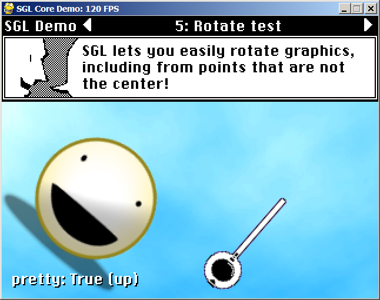

Examples
====

Currently there is only one extremely pathetic example.

SGL Core Demo
----

            SGL demonstrates its incredible graphic effects.

This is a demo for various features in ``sgl.core``. It is used internally for me to develop new features and make sure they are working correctly. Anything that does not appear in this demo has not been tested.

This means, for example, that I am still not sure if any of the audio commands work or not.

To navigate through the demos, press the left and right arrow keys. Most of the demos what you alter their parameters by pressing the up and down arrow keys.

The coding style of this demo is not necessarily indicative of what a normal SGL game would look like, as it intentionally avoids using any functions from ``sgl.lib``. So, it manages things manually that usually SGL would handle for you.

Also, it runs a series of separate demos as different classes, which are pretty much each separate SGL games, which a normal SGL game would have no need to do.

Hopefully even this complicated example showcases SGL's ability to be simple and easy to understand, though.
